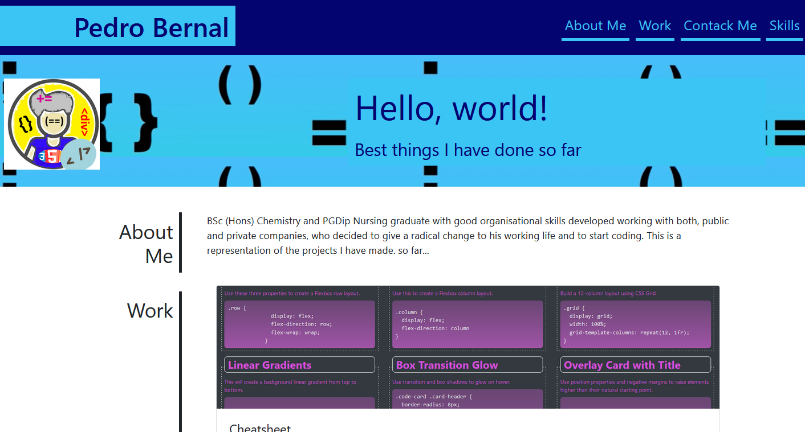
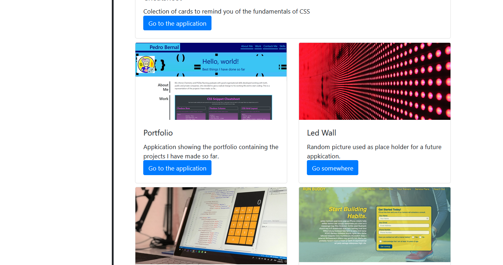

# Bootstrap-Portfolio

## Description

Portfolio developed during the Bootcamp course. I have re-develop a previous project to build a portfolio using Bootstrap. I intended to test my capacity to use Bootstrap and at the same time to make some improvements to the previous portfolio project.These changes will improve the usability.

## Installation

N/A.

## Usage

The project can be used to see the type of work carried out so far. 
Here can be found screenshots of the project.

## Credits

As this project is a remake of the initial portfolio, I have used and adapted code from the initial portfolio (URL of the deployed application: https://pedrobe9.github.io/pedrobe-portfolio/        URL of the GitHub repository that contains your code: https://github.com/Pedrobe9/pedrobe-portfolio).
I have used the website for Bootstrap as guidance and information source (https://getbootstrap.com/docs/4.3/getting-started/introduction/).

## License

Although the present project do not have an oficial licence, it can be used and distributed according to the terms of the MIT Licence.

